# Dotaro Deck

### Table of Contents

* [Overview](#overview)
* [Orientations](#orientations)
* [Examples](#examples)
* [Hybrid French-German-Spanish suits](#hybrid)
* [Frequently Asked Questions](#faq)
* [External links](#external)

**Warning:** The *Dotaro Deck* is currently at the **prototype** stage of development.  There are a few print-and-play files:

| Variant | PnP Cards | Manual | Jacket |
| --- | --- | --- | --- |
| Black and White French Suits | [letter](https://trevorldavis.com/piecepackr/share/pnp/dotaro_french_bw_letter.pdf) / [A4](https://trevorldavis.com/piecepackr/share/pnp/dotaro_french_bw_a4.pdf) | [letter](https://trevorldavis.com/piecepackr/share/pnp/dotaro_manual_french_bw_letter.pdf) / [A4](https://trevorldavis.com/piecepackr/share/pnp/dotaro_manual_french_bw_a4.pdf) | [letter](https://trevorldavis.com/piecepackr/share/pnp/dotaro_box_jacket_french_bw_letter.pdf) / [A4](https://trevorldavis.com/piecepackr/share/pnp/dotaro_box_jacket_french_bw_a4.pdf) |
| French Suits | [letter](https://trevorldavis.com/piecepackr/share/pnp/dotaro_french_color_letter.pdf) / [A4](https://trevorldavis.com/piecepackr/share/pnp/dotaro_french_color_a4.pdf) | [letter](https://trevorldavis.com/piecepackr/share/pnp/dotaro_manual_french_color_letter.pdf) / [A4](https://trevorldavis.com/piecepackr/share/pnp/dotaro_manual_french_color_a4.pdf) | [letter](https://trevorldavis.com/piecepackr/share/pnp/dotaro_box_jacket_french_color_letter.pdf) / [A4](https://trevorldavis.com/piecepackr/share/pnp/dotaro_box_jacket_french_color_a4.pdf) |
| Hybrid Suits | [letter](https://trevorldavis.com/piecepackr/share/pnp/dotaro_hybrid_letter.pdf) / [A4](https://trevorldavis.com/piecepackr/share/pnp/dotaro_hybrid_a4.pdf) | [letter](https://trevorldavis.com/piecepackr/share/pnp/dotaro_manual_hybrid_letter.pdf) / [A4](https://trevorldavis.com/piecepackr/share/pnp/dotaro_manual_hybrid_a4.pdf) | [letter](https://trevorldavis.com/piecepackr/share/pnp/dotaro_box_jacket_hybrid_letter.pdf) / [A4](https://trevorldavis.com/piecepackr/share/pnp/dotaro_box_jacket_hybrid_a4.pdf) |

## <a name="overview">Overview</a>

* The *Dotaro Deck* is a deck of 108 cards that can be used to play games from a variety of card game systems including:

  + several traditional card game systems:

    + one deck of traditional French-suited playing cards
    + two decks of traditional French-suited playing cards
    + one deck of traditional French-suited tarot cards
    + one double-nine set of dominoes
    + one set of Chinese dominoes

  + several modern card games including:

    - 10 suits with up to 10 ranks
    - 8 suits with up to 13 ranks
    - 5 suits with up to 20 ranks
    - 4 suits with up to 27 ranks
    - Pyramid decks e.g. 1 one, 2 twos, ..., 10 tens
    - Sequential decks with an ordinal ordering of up to 100 cards
    - A set of d6 dice cards
    - 2 x 5 x 10 dimensional deck
    - 2 x 2 x 2 x 13 dimensional deck

* Each card of the *Dotaro Deck* is vertically asymmetric with a light half and a dark half for a total of 2 x 108 = 216 card halves:

  + 112 "traditional suit" halves = 2 (light vs. dark) x 4 (French suits) x 14 (10 number ranks plus 4 face ranks)
  + 100 "number suit" halves = 2 (light vs. dark) x 5 (number suits) x 10 (10 number ranks)
  + 4 "fool" halves = 2 (light vs. dark) x 2 (circle vs. star)

* Each light half and dark half are combined to create the three types of cards in the *Dotaro Deck*:

  + Each of the hundred "number suit" halves is paired with a "traditional suit" half.  These halves are allocated such that there are double-9 domino, Chinese domino, and d6 dice card subdecks.

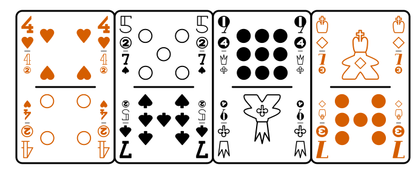

  + Each of the four "knight" rank halves is combined with the other "knight" rank half of the same French suit.

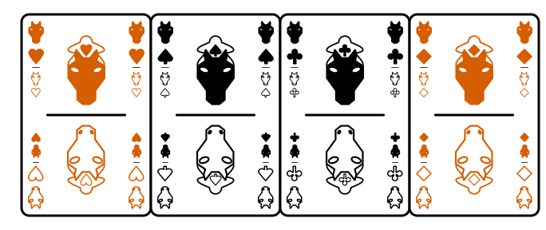

  + Each of the four unsuited "fool" halves is paired with either a Queen of Spades half or a Jack of Diamonds half (which are special cards in [Bezique](https://www.pagat.com/marriage/bezique.html), [Hearts](https://www.pagat.com/reverse/hearts.html), [Pinochle](https://www.pagat.com/marriage/pinmain.html), [Scabby Queen](https://en.wikipedia.org/wiki/Old_maid_(card_game)#Scabby_Queen), etc.).

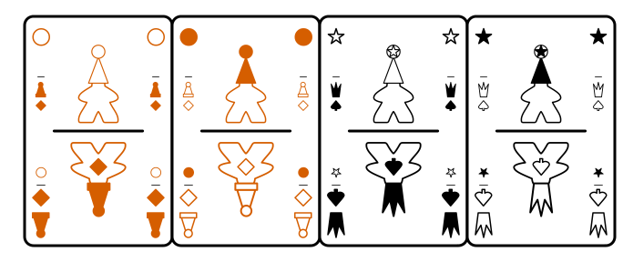

* Each index shows the top orientated half's rank and suit in a larger size and then beneath it shows the bottom orientated half's rank and suit in a smaller size.
  Cards are ambidextrous (i.e. left and right corner indices are the same) so cards can be fanned either left or right as each player prefers.
  Thus if playing domino games all relevant card information is available on any of the four corners but for traditional card games one can just focus on the larger top most rank and suit symbol (on either the left or right side) after orienting the card halves to the correct side for the game (usually either traditional suit halves, number suit halves, dark halves, or light halves orientated up top).

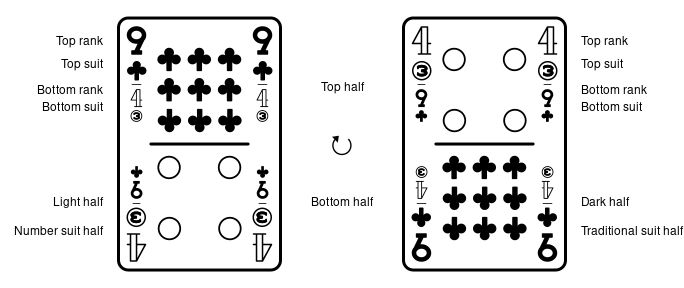

## <a name="orientations">Orientations</a>

### Dark halves up top

* 4 traditional suits x 14 traditional ranks
* 5 number suits x 10 number ranks

  + If the number suit number is treated as a tens digit and the rank as the ones digit then the number suit cards go from 00 to 49

* 2 fools

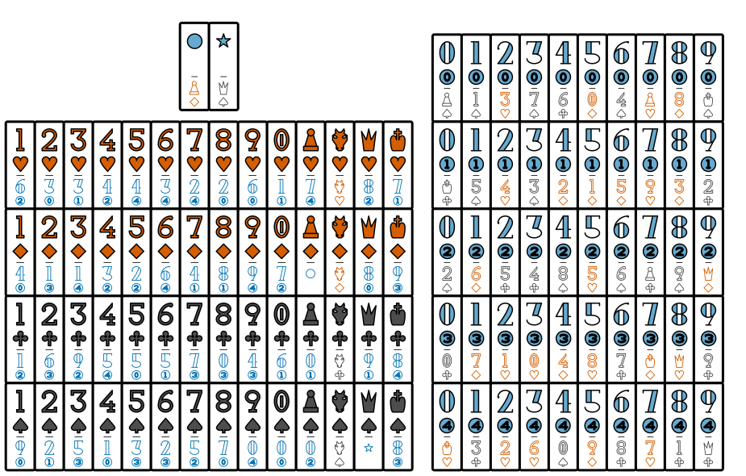

### Light halves up top

* 4 traditional suits x 14 traditional ranks
* 5 number suits x 10 number ranks

  + If the number suit number is treated as a tens digit and the rank as the ones digit then the number suit cards go from 00 to 49

* 2 fools

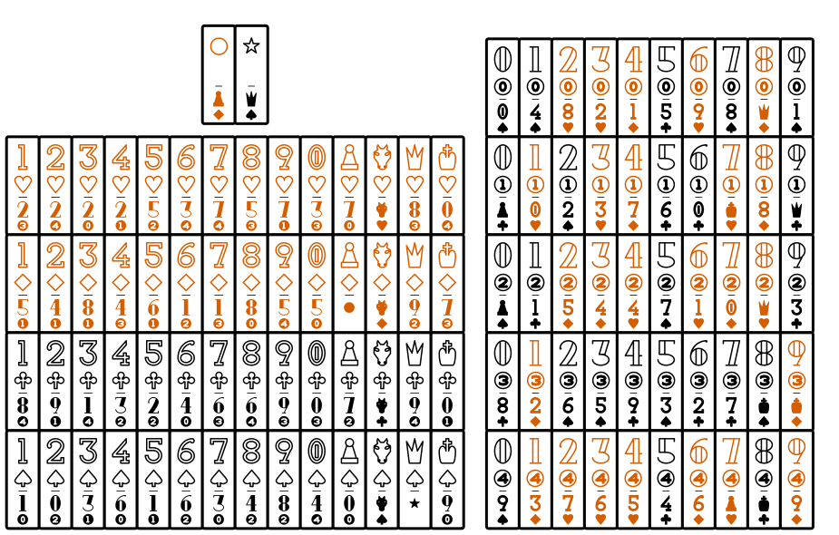

### Traditional suit halves up top

* Note both halves of the four knights has a traditional suit.
* Can be treated in the following ways:

  * 8 suits up to 13 ranks (i.e. treat light/dark suits as different suits)
  * 2 x 4 suits x 13 ranks (i.e. treat each French suit card as the same)
  * 4 suits x 27 ranks (i.e. treat each French suit as the same suit but let dark cards break ties with light cards)

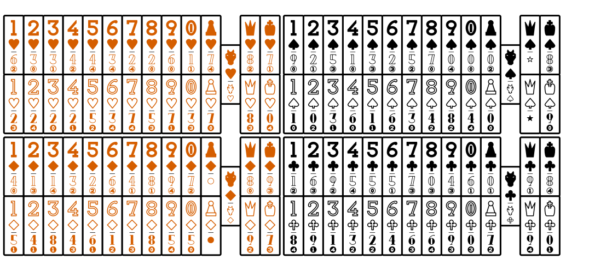

### Traditional suit halves down below

* Can be treated in the following ways:

  + 10 suits up to 10 ranks (i.e. treat light/dark suits as different suits).
  + 2 x 5 suits x 10 ranks (i.e. treat light/dark suits as the same).
  + 5 suits x 20 ranks (i.e. treat light/dark suits as the same but let dark suit cards break ties with light suit cards).
  + Create a pyramid deck i.e. 1 one, 2 twos, ..., 10 zeros.
  + If you treat each number suit as the tens digit and each rank as the ones digit then you have two copies of two digit numbers going from 00 to 49.  If you let the dark suit card break ties with light cards then you have an ordinal sequence of up to one hundred cards (some prefer to treat dark cards as a "+50").

* Note below omits the four knights which has a traditional suit on both halves.

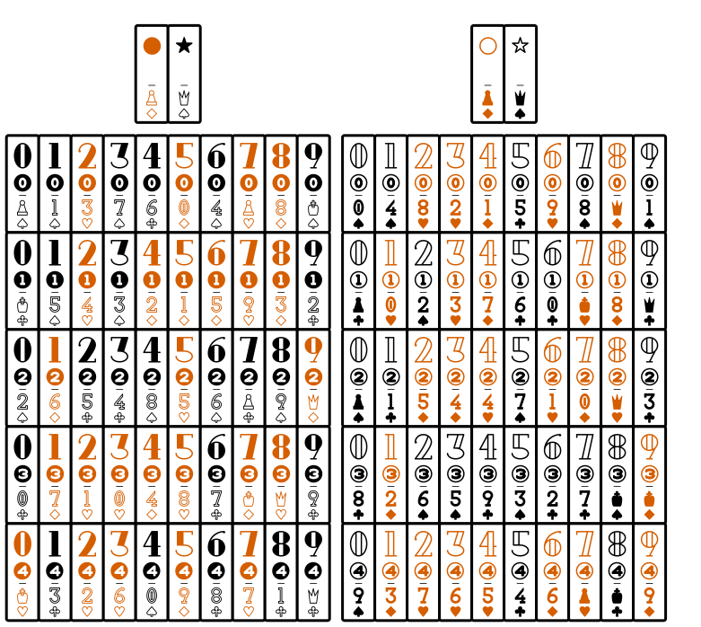

## <a name ="examples">Examples</a>

### One deck of traditional French-suited playing cards

* Orient dark halves up top.
* Treat the 0 rank as tens and the pawn rank as jacks.
* If necessary use the two fools as jokers (if you need more jokers you also have four knights and fifty number cards).

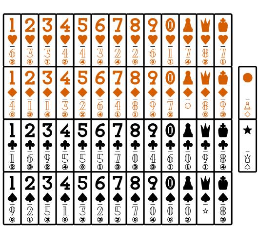

### Two decks of traditional French-suited playing cards

* Orient traditional suit halves up top.
* Treat each dark/light French suit as the same suit.
* If necessary use the four knights as jokers e.g. the two hearts/diamonds knights can serve as "red" jokers and the two spades/clubs knights can serve as "black" jokers.
* The four [Pinochle](https://www.pagat.com/marriage/pinmain.html) legs (i.e. Queens of Spades / Jacks of Diamonds) are opposite the four Fool cards.

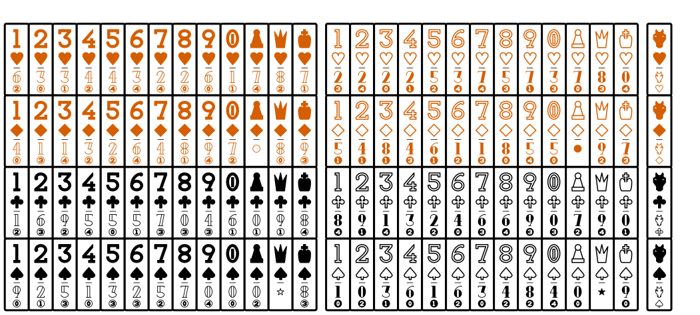

### One deck of traditional French-suited tarot cards

* [French-suited tarot cards](https://www.pagat.com/class/ftarot.html) feature four suits with 14 ranks each, 21 trumps numbered from 1 to 21, and a fool.
* Orient dark halves up top.
* The traditional "0" rank is a ten and the "pawn" rank is a jack/page.
* For the trump cards treat each of the number suits as a two digit number with the number suit as the ten digit number and the rank as the one digit number.
* Use the star fool as the Fool/Excuse (in French Tarot Nouveau decks the Fool is usually represented by a star index).  However in some tarot card games the fool is the lowest or highest trump in which case it may make sense to instead use the number suit card corresponding to "00" or "22".

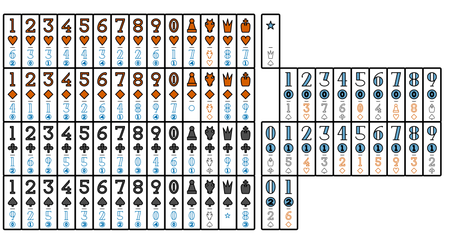

### One double-nine set of dominoes

* [Double-nine dominoes](https://www.pagat.com/domino/) features all 55 pairings of the numbers 0 to 9 (including pairing each number with itself).
* Not only does each of the five number suits (ignoring light/dark distinctions) have exactly 11 cards but for this subset of cards each number suit equals the total number of pips on each card modulo 5.  In particular a *necessary* condition that a card is a scoring card in games like [Texas 42](https://www.pagat.com/domino/trick/42.html) is that the number suit is zero.

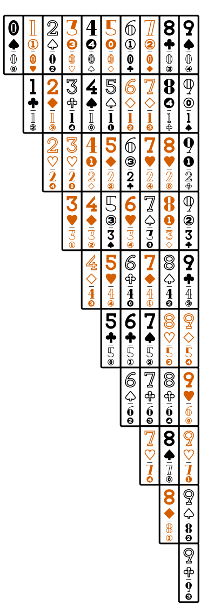

### One set of Chinese dominoes

* [Chinese dominoes](https://www.pagat.com/domino/chinese.html) has 32 combinations of throwing two d6 dice.

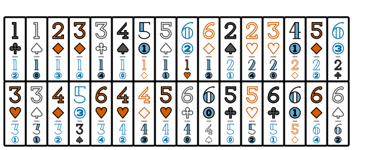

### One set of d6 dice cards

* Each of the 36 possible combinations of throwing two d6 dice.
* For this subset of cards the number suit equals the total number of pips modulo five.

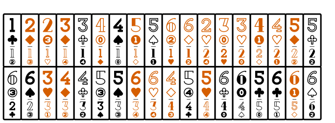

## <a name="hybrid">Hybrid French-German-Spanish suits</a>

Above we described the French-suited Dotaro Deck but we also offer a Dotaro Deck that features hybrid French-German-Spanish suits:

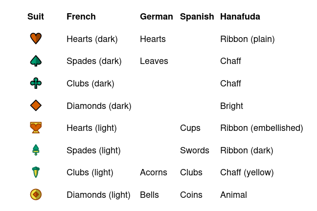

This deck can build all the decks that the French-suited Dotaro Deck can but also makes it a bit friendlier to make German-suited and Latin-suited playing card decks as well as play Hanafuda games.

### One deck of German-playing cards

* The German suits are the *shaded* suits.
* Use pip cards 2, 6-9, 0 (interpreted as ten) and use the pawn (for the *under*), knight (for the *ober*), and the king.
* Pedantically the German *ace* is actually the *deuce* (rank two card) and is sometimes called the *Sow*.  Depending on your preference you could use the 1 rank card instead as the *ace*.
* The suit symbol is only *over* the rank symbol in the *ober* face card.
* Northern German decks commonly omit the 6 rank card.
* Decks made by Italian manufacturers for South Tyroleans include a 5 rank card.

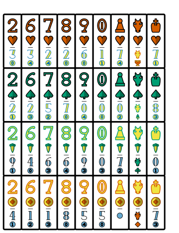

### One deck of Spanish playing cards

* Use pip cards 1-9 and use the pawn for the *sota*, knight for the *caballo*, and king for the *rey*.
* If necessary use the two fools as jokers (if you need more jokers you also have four knights and fifty number cards).
* It is common for Spanish-suited decks to omit jokers and/or the 8 and 9 ranks.

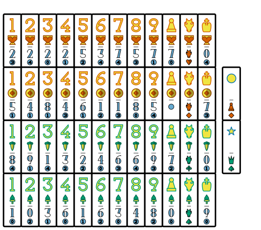

### One deck of Latin-suited tarot cards

* [Latin-suited tarot cards](https://www.pagat.com/class/itarot.html) feature four suits with 14 ranks each, 21 trumps numbered from 1 to 21, and a fool.
* Orient dark halves up top.
* The traditional "0" rank is a ten and the "pawn" rank is a jack/page.
* For the trump cards treat each of the number suits as a two digit number with the number suit as the ten digit number and the rank as the one digit number.
* Use the star fool as the Fool/Excuse.  However in some tarot card games the fool is the lowest or highest trump in which case it may make sense to instead use the number suit card corresponding to "00" or "22".
* Some Tarot games such as [Minchiate](https://www.pagat.com/tarot/minchiate.html) will need extra trumps (you can keeping adding number suit cards for up to 50 ordered trump cards plus two fools).

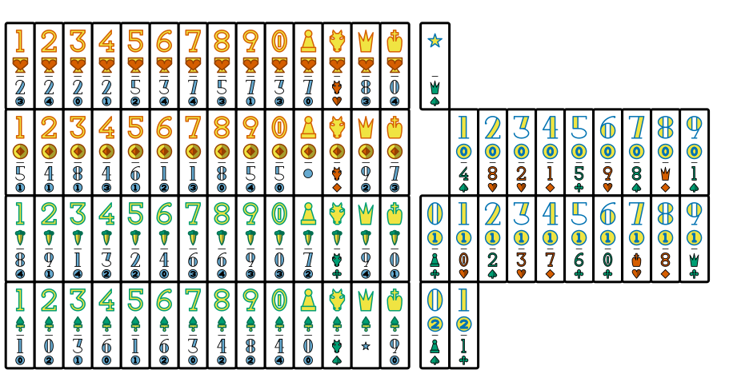

### Deck of Hanafuda cards

* For the twelve month Hanafuda *suits* use Dotaro Deck *ranks* 1-9, 0 (as ten = October), pawn (as eleven = November), and queen (as twelve = December).
* The green leaves, clovers, and acorns are *chaff* (aka *junk*).  Acorns are the only yellow chaff so use the Acorns as the *yellow* Paulownia.
* The heart-shaped hearts, cups, and swords are *ribbons*.  Use hearts as *plain* ribbons, cups as *embellished* ribbons (e.g. *poetry* ribbons), and swords as *dark* ribbons (e.g. *blue* / *purple* ribbons).
* The (hawk) bells are *animals*.
* The *diamonds* are *brights*.
* Different arrangement of suits and categorizations of cards exist depending on the game.  Here is an example for the "standard" order and categorization from the [Fuda Wiki](https://fudawiki.org/en/hanafuda):

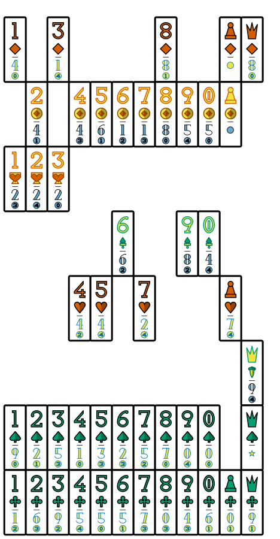

## <a name="faq">Frequently Asked Questions</a>

### Why the name Dotaro?

* The *Dotaro Deck* is inspired by domino sets and tarot decks and Dotaro is an abbreviation of Domino Tarot.
* In Esperanto the word "dotaro" would mean something like "collection of endowments" and the *Dotaro Deck* can be used to play a wide variety of the playing card legacies our ancestors have endowed us with.

## <a name="external">External links</a>

### Overviews

* [Crafting Additional Playing Card Suits](https://www.dragoncompany.org/crafting-additional-playing-card-suits/)
* [Playing Card Decks with Five or More Suits](http://www.solitairelaboratory.com/cards/FiveOrMoreSuits.html)
* [Playing Card Game Systems](https://boardgamegeek.com/geeklist/252876/playing-card-game-systems) Geeklist
* [Ranks and Suits - The Anatomy of Decks of Cards](https://boardgamegeek.com/geeklist/165733/ranks-and-suits-the-anatomy-of-decks-of-cards) Geeklist
* [Suits and Patterns](https://www.altacarta.com/english/collect/suits/index.html)

### Selected Multidecks

* [The 144 Deck](https://boardgamegeek.com/boardgame/446495/the-144-deck)
* [Badger Deck](https://boardgamegeek.com/boardgame/160950/the-badger-deck)
* [Banjo Deck](https://banjodeck.com/)
* [Baron's Proxy](https://www.drivethrucards.com/product/463233/The-Barons-Proxy)
* [DIY Multideck](https://diymultideck.mauri.app/)
* [EPiC deck](https://www.nemsworld.com/epic/)
* [Everdeck](https://boardgamegeek.com/boardgame/291951/the-everdeck)
* [Glyph](https://boardgamegeek.com/boardgame/153898/glyph)
* [Micaya Deck](https://micaya.selfthinker.org/)
* [Poly Card Deck](https://www.kickstarter.com/projects/mariofaiella/the-poly-card-deck/description)
* [Potluck](https://hamatti.org/tabletop/potluck/)
* [Rainbow deck](https://boardgamegeek.com/boardgame/59655/rainbow-deck)
* [Singularity Deck](https://www.singularity.games/singularity-deck)
* [Skeleton Deck](https://kevan.org/games/skeleton)
* [Wil Su's numbered double-deck experiment](https://boardgamegeek.com/thread/1867714/article/36786465#36786465)

### Triangle/Pyramid decks

* [Games You Can Play With a Triangular Deck](https://boardgamegeek.com/geeklist/222403/games-you-can-play-with-a-triangular-deck) Geeklist
* [List of Triangle/Pyramid deck card games](https://boardgamegeek.com/geeklist/186807/list-of-trianglepyramid-deck-card-games-please-add) Geeklist
* [The Great Dalmuti](https://boardgamegeek.com/boardgame/929/the-great-dalmuti)
* [Pairs](https://crabfragmentlabs.com/pairs)
* [Somerset](https://www.somersetgame.com/)

### Dark/light suits

* [The 144 Deck](https://boardgamegeek.com/boardgame/446495/the-144-deck)
* [Blossom Deck](https://crabfragmentlabs.com/island-deck)
* [Dual piecepacks](https://trevorldavis.com/piecepackr/dual-piecepacks-pnp.html)
* [Duplhex Playing Cards](https://www.thegamecrafter.com/games/duplhex-playing-cards)
* [Gamelib Pocket](https://www.gamelibpocket.com/en/)
* [Rainbow deck](https://boardgamegeek.com/boardgame/59655/rainbow-deck)
- [Star-Pip Playing Cards](http://tamivox.org/xovimat/star_pip/index.html)

### Asymmetric decks

* [Dark Hand deck](https://www.jankendeck.com/dark)
* [Dual Deck](https://boardgamegeek.com/boardgame/112802/dual-deck)
* [Mirror Deck](https://danielsolisblog.blogspot.com/2024/09/analyzing-mirror-deck-for-game-design.html)
* [Singularity Deck: Asymmetric Layout](https://www.singularity.games/singularity-deck)
* [Split Suit Playing Cards](https://boardgamegeek.com/boardgame/156181/split-suit-playing-cards)

* Domino decks:

  + [Bandit](https://www.thegamecrafter.com/games/bandit)
  + [Chinese Domino Cards](http://anthonylesq.blogspot.com/2019/02/chinese-domino-cards.html) and [Antique Chinese Domino Cards](https://www.criticaleyefinds.com/products/antique-chinese-domino-cards?variant=40655289647300)
  + tjgames' [Domino Deck](https://www.thegamecrafter.com/games/domino-deck)
  + [Double-Six Suited Deck](https://www.thegamecrafter.com/games/suited-double-6-domino)
  + [Double-9 Pokadeck](https://www.thegamecrafter.com/games/double-9-pokadeck)
  + [Flexdeck](https://www.amazon.com/Flexdeck-Dominoes-Combined-Playing-Adults/)
  + Cartesian Cards' [One Deck](https://cartesiancards.com/products/one-deck-game-cards)
  + [Quadkopf](https://www.thegamecrafter.com/games/quadkopf-double-9-domino-tin-deck)
  + [Xovimat Playing Cards](http://tamivox.org/dave/XovimatCard/index.html)

### Chess-related decks:

* [Chess Cards](https://boardgamegeek.com/geeklist/199391/chess-cards-using-cards-or-tiles-as-pieces-to-play) Geeklist
* [CardChess](https://boardgamegeek.com/boardgame/19062/cardchess)
* Cartesian Cards' [One Deck](https://cartesiancards.com/products/one-deck-game-cards)
* [En Prise](https://boardgamegeek.com/boardgame/153791/en-prise-chess-cards)
* [K6T](https://boardgamegeek.com/thread/1478158/k6t-a-new-playing-cards-deck)
* [The King's Caste](https://boardgamegeek.com/boardgame/38417/the-kings-caste)

### Tarot decks

* [Classic Tarok](https://www.alpencrowd.eu/classic-tarok-teaser/)

* Elettra Deganello

  + [Genoese Tarot](https://shop.elettradeganello.com/collections/frontpage/products/genoese-tarot)
  + [Tarocco Genovese](https://shop.elettradeganello.com/collections/frontpage/products/tarocco-genovese)

* French Bourgeois Tarot Nouveau

  + <https://en.wikipedia.org/wiki/Bourgeois_Tarot>
  + <https://l-pollett.tripod.com/cards28.htm>

* [The King's Caste](https://boardgamegeek.com/boardgame/38417/the-kings-caste)
* [Rider Waite Playing Card Deck](https://www.amazon.com/Rider-Waite-Playing-Card-Games-Systems/dp/1646710185/)
* [Trio Play Tarot Deck](https://boardgamegeek.com/boardgame/386643/trio-play-tarot-deck)
